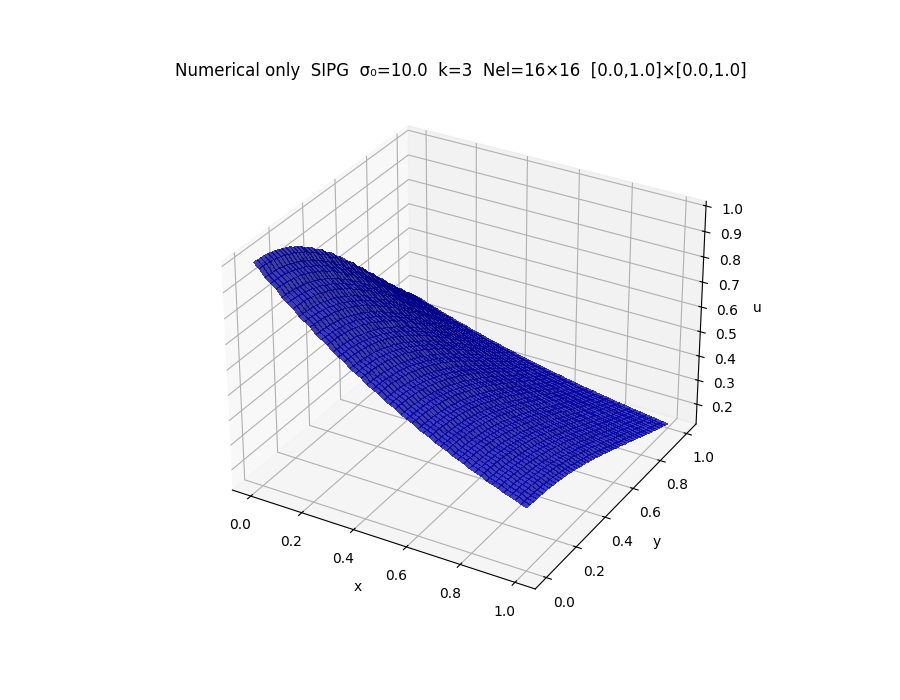
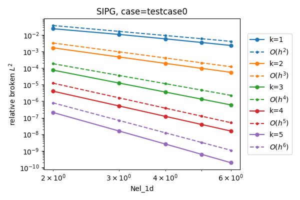
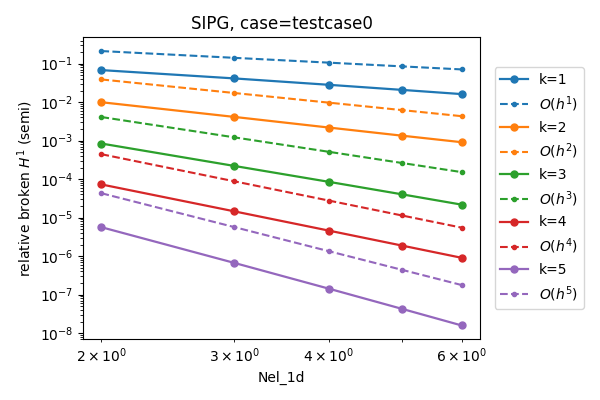
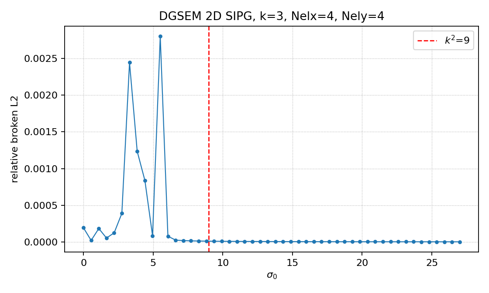
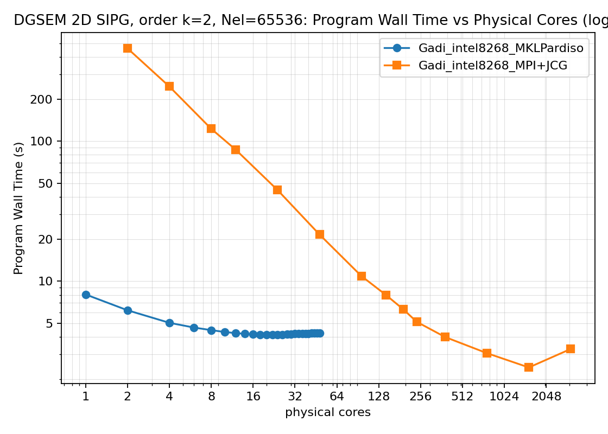

# DGSEMElliptic2DRec
practice project on DGSEM 2D rectangular grid for Elliptic PDEs, using Eigen's intel Pardiso sparse direct solver with OPENMP

# Machine.mk
For different hardware platform (example included are ubuntu(x86)+gcc, gadi+gcc/intel, macos(arm64 apple silicon)+clang, just select different `BUILD_ENV` in machine.mk


# Dependencies
### install highfive
```bash
cd /usr/local/include
git clone --recursive https://github.com/BlueBrain/HighFive.git
cd HighFive
cmake -DCMAKE_INSTALL_PREFIX=build/install -DHIGHFIVE_USE_BOOST=Off -B build .
cmake --build build --parallel
cmake --install build
```

### ubuntu
```bash
sudo apt install libeigen3-dev
sudo apt install libhdf5-dev
```

### gadi
```bash
module load eigen/3.3.7
module load hdf5/1.10.7
module load intel-mkl/2025.2.0
module load intel-compiler-llvm/2025.2.0
```

# Build
```bash
make testSolver_sp
```

# Run
### simple run
```bash
./testSolver_sp n SIPG 3 10 256 256 0 6.283185307179586 0 6.283185307179586 "L=D,R=D,B=N,T=N" cases/testcase0.json
```

### Convergence test
```bash
./runConvergence.sh SIPG testcase0
```

### Sigma penalty scan
```bash
python3 scanSigma.py \
  --exe ./testSolver_sp \
  --method SIPG \
  -k 3 \
  --nelx 4 --nely 4 \
  --bc "L=D,R=D,B=D,T=D" \
  --case ./cases/testcase0.json \
  --write nw
```

### omp scaling test
```bash
./runOmpScaling.sh
```

# Demonstration
### Solution: testcase0
<!-- plain mark down fig size is too large:  -->


### Convergence: testcase0



### DG(SIPG) penalty parameter scan: testcase0


### Pardiso OMP scaling vs Matrix Free MPI Jacobi-precondition CG (work in progress):testcase0



